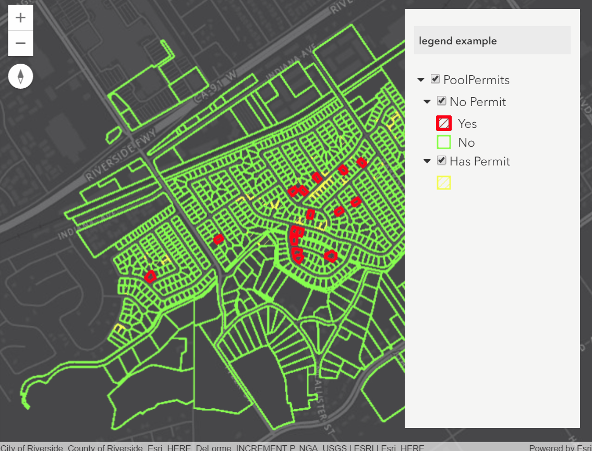

# ArcGIS JS API V4 Legend

[](https://www.npmjs.com/package/arcgis-react-redux-legend)
 
Combined legend and layer list control for the ArcGIS JS API V4 that uses React and Redux
 


### Run locally

grab this repo (fork / download) then run `npm install` wait a while and then get running with `npm start` then go to `http://localhost:8811/docs`.

### Usage

To add to your site first make sure you have the dependencies installed, we asume you are using React, Redux, React Bootstrap and Esri Loader. For the full list refer to the [package.json](https://github.com/davetimmins/arcgis-react-redux-legend/blob/master/package.json) peerDependencies.

Now add the reducer

```js
import { combineReducers } from 'redux';
import {reducer as mapLegendReducer} from "arcgis-react-redux-legend";

const reducer = combineReducers(
  {    
    mapLegendConfig: mapLegendReducer
  }
);
```

then where you are creating your map control you need to add the MapLegend component and initialise it 

```html
// in your render function, use the ref to pass to the Esri JS API
<div mapId={mapId} ref="mapView">
  <MapLegend mapId={mapId} />
</div>
```

```js
import {MapLegend,setInitialLegend} from "arcgis-react-redux-legend";

// bootstrap the Esri API using esri-loader and create your view
// mapId should be the unique name to identify the map. You can add multiple maps and legends so long as the mapId is unique
this.props.dispatch(setInitialLegend(view, mapId));
```

`setInitialLegend` will listen for your view being ready and also watch the scale changing so that the legend scale dependency updates accordingly.

For a complete example check out the source in the docs folder for [map-view](https://github.com/davetimmins/arcgis-react-redux-legend/blob/master/docs/src/components/map-view.js)

Currently only supports MapImageLayers.